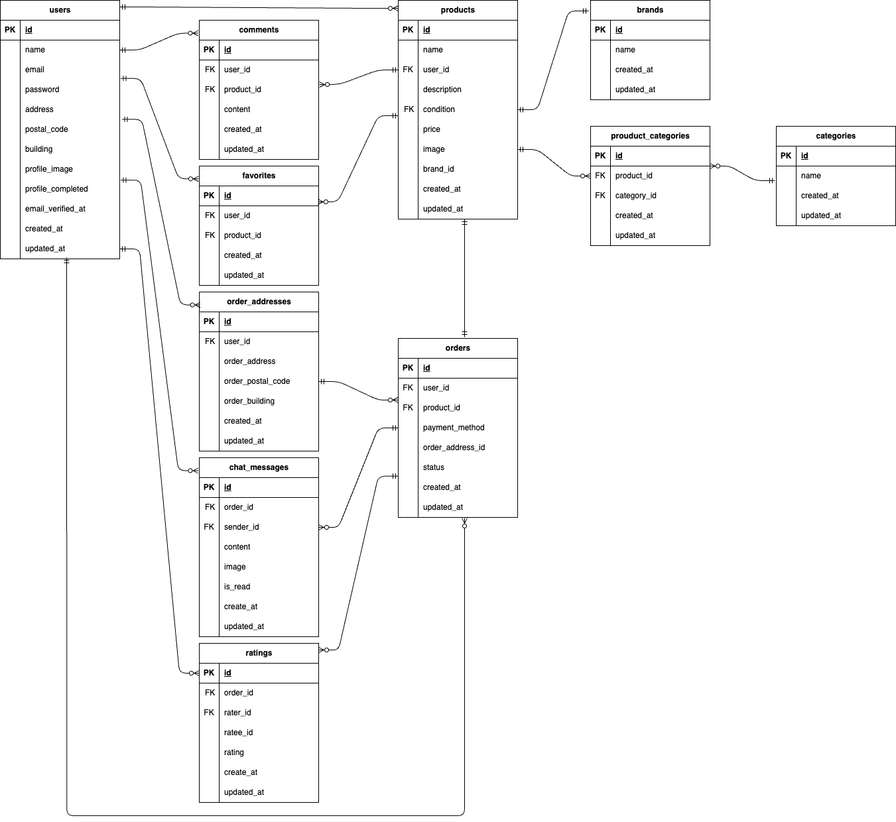

# mock-furima

## 環境構築

### Dockerビルド
1. プロジェクトのルートディレクトリに移動し、以下のコマンドでクローンします</br>
HTTP形式：
`git clone https://github.com/yurikoUe/mock-furima.git`  
SSH形式：
`git clone git@github.com:yurikoUe/mock-furima.git`

2. `docker-compose up -d --build`
>MacのM1・M2チップのPCの場合、`no matching manifest for linux/arm64/v8 in the manifest list entries`のメッセージが表示され、ビルドができないことがあります。エラーが発生した場合は、docker-compose.ymlファイルの「mysql」の記述箇所に、platformの項目を追加で記載し、もう一度ビルドしてください。
```
mysql:
    platform: linux/x86_64（この文を追加）
    image: mysql:8.0.26
    environment:
```
3. DockerDesktopアプリでコンテナが起動していることを確認してください

### Laravel環境構築
1. `docker-compose exec php bash`
2. `composer install`
3. 「.env.example」ファイルを「.env」ファイルに命名変更するか、以下のコマンドで「.env.example」をコピーして「.env」を作成。

`cp .env.example .env`

4. .envファイル内のDBの箇所を以下のように変更
```env
DB_CONNECTION=mysql
DB_HOST=mysql
DB_PORT=3306
DB_DATABASE=laravel_db
DB_USERNAME=laravel_user
DB_PASSWORD=laravel_pass
```

5. アプリケーションキーの作成をします

`php artisan key:generate`

6. シンボリックリンクの作成をします

`php artisan storage:link`

7. マイグレーションの実行をします

`php artisan migrate`

8. シーディングの実行

`php artisan db:seed`

## メール認証の設定

このアプリケーションでは、メール認証が必要です。ユーザーが登録後、「メール認証」を完了するまで、ログインできないように設定されています。以下の手順でメール認証を使用するための設定を行ってください。

1. `.env` ファイルで、以下のメール関連の設定を行います。

    ```env
    MAIL_MAILER=smtp
    MAIL_HOST=mock-furima-mailhog-1  #Dockerコンテナ名（環境によって異なる場合があります）
    MAIL_PORT=1025
    MAIL_USERNAME=null
    MAIL_PASSWORD=null
    MAIL_ENCRYPTION=null
    MAIL_FROM_ADDRESS=no-reply@furimapp.local  # 必要に応じて変更
    MAIL_FROM_NAME="${APP_NAME}"
    ```

    **注意:** `MAIL_HOST` は、Mailhogのコンテナ名で設定してください。`docker ps` コマンドでMailhogのコンテナ名（例: `mock-furima-mailhog-1`）を確認できます。

2. 認証方法
- メール認証機能を動作させるためには、ユーザーが登録後に受信したメール内のリンクをクリックして、認証を完了する必要があります。Mailhogのウェブインターフェース (`http://localhost:8025`) でメールを確認できます。

3. ログインの制御確認
- usersテーブルのemail_verified_atカラムが null の場合、ログインできません。登録後、認証をすることにより、email_verified_atカラムがに認証時の時間が入ります。

## Stripe決済の導入
本アプリでは Stripe を使用して決済を行います。

1. 環境変数の設定
    以下のStripe APIキーを`.env` ファイルに追加してください。

    ```env
    STRIPE_KEY=your_stripe_public_key
    STRIPE_SECRET=your_stripe_secret_key
    ```
    APIキーはStripeに登録した後、Stripeのダッシュボード からテスト環境のAPIキーを取得してください（https://dashboard.stripe.com/test/apikeys）。

    [Stripe公式サイト](https://stripe.com/jp?utm_campaign=APAC_JP_JA_Search_Brand_Payments-Pure_EXA-21278920274&utm_medium=cpc&utm_source=google&ad_content=714155577511&utm_term=stripe&utm_matchtype=e&utm_adposition=&utm_device=c&gad_source=1&gclid=Cj0KCQjwhMq-BhCFARIsAGvo0Kde-7Fg6U7v2NTt4uBilQa9vI2G0Sk_U19TmXSWLmxrDDyY7Fbv_ncaAnIJEALw_wcB)


2. ローカル環境でのテスト（決済）

    開発環境では、Stripeの テスト用カード(以下参照）) を使用して決済を試すことができます。

     ```
    カード番号: 4242 4242 4242 4242
    有効期限: 任意の未来の日付（例: 12/34）
    CVC: 任意の3桁の番号（例: 123）
     ```

    **注意:**
    * テスト環境では 実際の決済は行われません。
    * 本番環境へ移行する際は、 本番用のAPIキーを設定 してください。


3. 決済の流れ

    本アプリでは、クレジットカード決済とコンビニ決済を搭載しており、それぞれで以下のように動作します。

    - クレジットカード決済の場合
        1. 商品をカートに追加し、支払い方法を選択後、購入ボタンをクリック
        2. クレジットカード情報を入力
        3. Stripe API を通じて決済を実行
        4. 決済成功後、注文が確定し商品が購入済みとなる(Ordersテーブルのstatusが「決済完了」となる)

    - コンビニ決済の場合
        1. 商品をカートに追加し、支払い方法としてコンビニを選択し、購入ボタンをクリック
        2. 電話番号を入力
        3. Stripe API を通じて決済を実行
        4. Ordersテーブルのstatusが「決済待機中」となる
        5. メールで支払い方法の詳細が届く（テスト環境では省略）
        6. Stripeで決済が確認され次第、「決済完了」になる


## PHPunitテストの実行について

1. テスト準備（MySQOにテスト用のデータベースがない人は、以下に従って準備をしてください）

    1. MySQLコンテナからMySQLに、rootユーザでログインして、demo_testというデータベースを作成します。

        新規でデータベースを作成する際は、権限の問題でrootユーザ（管理者)でログインする必要があります。

        ```MySQLコンテナ上
        $ mysql -u root -p
        ```

        パスワードを求められるので、docker-compose.ymlファイルのMYSQL_ROOT_PASSWORD:に設定されているrootを入力します。

        MySQLログイン後、以下のコードでdemo_testというデータベースを作成します。

        ```
        CREATE DATABASE demo_test;
        ```

        以下のコードで、demo_testが作成されていれば成功です。
        ```
        SHOW DATABASES;
        ```
    
    2. configファイルの変更

        configディレクトリの中のdatabase.phpを開き、mysqlの配列部分をコピーして、その下に新たにmysql_testを作成します。
        配列の中のdatabase、username、passwordは以下のように変更します。

        **'database' => 'demo_test',**
        **'username' => 'root',**
        **'password' => 'root',**

        ＜以下、参照＞

        ```database.php
        'mysql_test' => [
            'driver' => 'mysql',
            'url' => env('DATABASE_URL'),
            'host' => env('DB_HOST', '127.0.0.1'),
            'port' => env('DB_PORT', '3306'),
            'database' => 'demo_test',
            'username' => 'root',
            'password' => 'root',
            'unix_socket' => env('DB_SOCKET', ''),
            'charset' => 'utf8mb4',
            'collation' => 'utf8mb4_unicode_ci',
            'prefix' => '',
            'prefix_indexes' => true,
            'strict' => true,
            'engine' => null,
            'options' => extension_loaded('pdo_mysql') ? array_filter([
                PDO::MYSQL_ATTR_SSL_CA => env('MYSQL_ATTR_SSL_CA'),
            ]) : [],
        ],
        ```database.php

    3. テスト用の.envファイル作成

        次に、PHPコンテナにログインし、.envをコピーして.env.testingというファイルを作成しましょう。

        ```PHPコンテナ上
        cp .env .env.testing
        ```database.php

        ファイルの作成ができたたら、.env.testingファイルの文頭部分にあるAPP_ENVとAPP_KEYを以下のように編集します。

        ```
        APP_ENV=test
        APP_KEY=
        ```

        次に.env.testingにデータベースの接続情報を以下のように編集してください。

        ```
        DB_DATABASE=demo_test
        DB_USERNAME=root
        DB_PASSWORD=root
        ```

        先ほど「空」にしたAPP_KEYに新たなテスト用のアプリケーションキーを加えるために以下のコマンドを実行します。

        ```
        php artisan key:generate --env=testing
        ```

        キャッシュをクリアします。
        ```
        php artisan config:clear
        ```

        マイグレーションコマンドを実行して、テスト用のテーブルを作成します。
        ```
        php artisan migrate --env=testing
        ```


2. 外部決済システムStripeを使用しているため、PHPunitテストをするためにMockery が必要です。以下のコマンドでインストールします。

    ```
    composer require mockery/mockery --dev
    ```


3. テスト実行

    テストは以下のコマンドで実行できます。

    ```
    vendor/bin/phpunit src/tests/Feature/テストファイル名
    ```

    テストファイルは src/tests/Feature/以下にあるので、そちらでファイル名を確認してください。


## 使用技術
- **Laravel**: 8.75
- **Docker**: 最新版
- **MySQL**: 8.0.26
- **PHP**: 7.4.9
- **Nginx**: 1.21.1
- **phpMyAdmin**

## ER図

以下は、プロジェクトのER図です。




## URL
+ 開発環境: http://localhost/
+ phpMyAdmin: http://localhost:8080/
+ Mailhog: http://localhost:8025